# Module-14-Challenge

FinTech Bootcamp Module 14 Challange due June 23, 2023

# Challenge - Venture Funding with Deep Learning

Venture Funding with Deep Learning notebook

## Analysis

We use machine learning and neural networks to create a binary classifier model that will predict whether applicants can become successful.

The CSV file contains a variety of information about these businesses including past successes.

## Purpose

We provide risk management associate expertise at Alphabet Soup venture capital firm.

## Steps

#### Establish a Baseline Performance

#### Tune the Baseline Trading Algorithm

#### Evaluate a New Machine Learning Classifier

#### Create an Evaluation Report

## Results

### 3 Months --------------------------------------------------------------
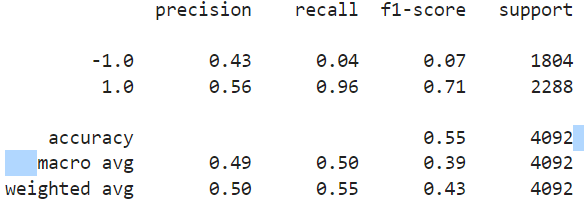
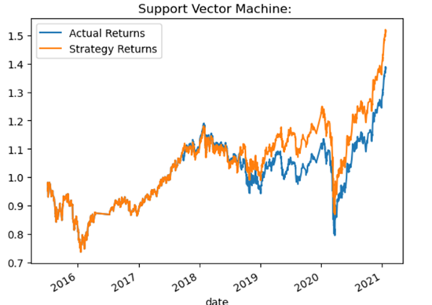
### 6 Months --------------------------------------------------------------
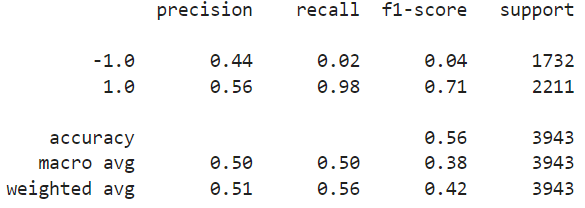
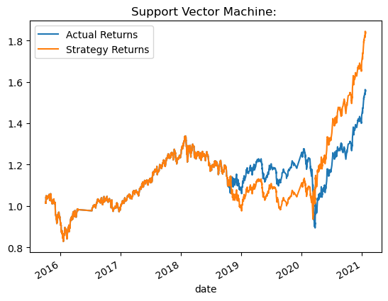
### 1 Months --------------------------------------------------------------
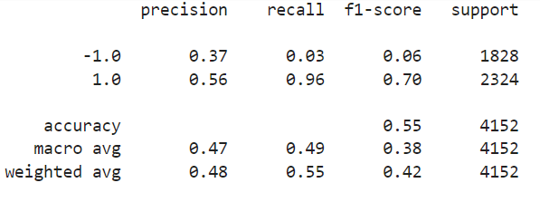
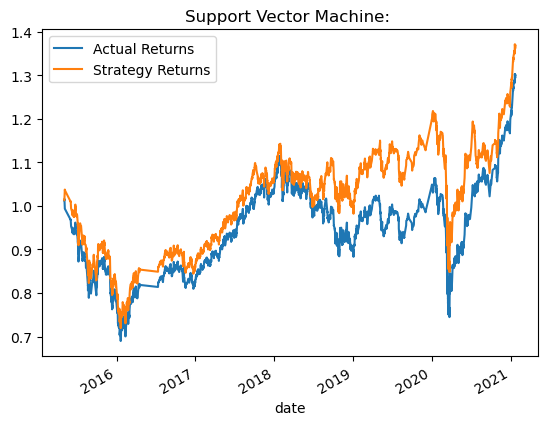

### What impact resulted from increasing or decreasing the training window?
Increasing the window from 3 Months to 6 Months led to an 0.08 point increase in accuracy, 0.48 to 0.56. While lowering from 3 months to 1 month, decreased the accuracy by 0.01 from 0.56 to 0.55. The Strategy Returns is highest at 1.8 for 6 months.

### 6mo-8-100sw ------------------------------------------------------------------
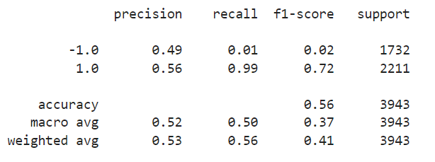
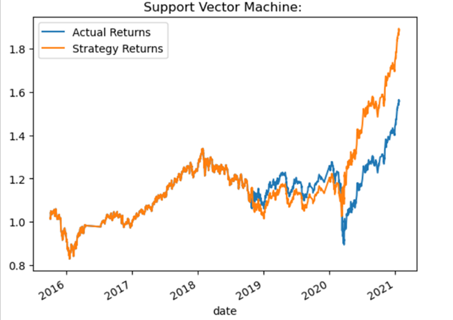

### 6mo-1-100 sw ------------------------------------------------------------------
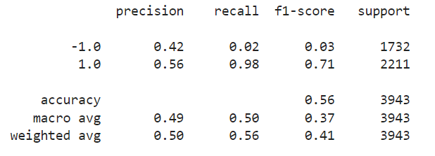
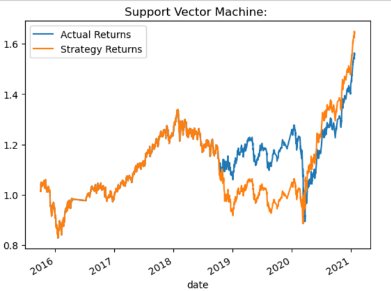

### What impact resulted from increasing or decreasing either or both of the SMA windows?

Increasing the SMA window from 4-100 to 8-100 improve the Strategy Returns from late 2019 to early 2021, and the 1.0 f1-score slilghtly from 0.71 to 0.72.

### -lr-6mo-8-100 ------------------------------------------------------------------
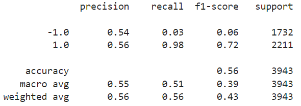
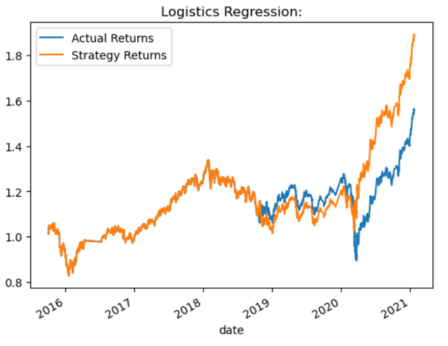

### Did this new model perform better or worse than the provided baseline model? 

Yes. It performed better. The Logistics Regression model has Strategy Returns approaching 1.9, far better than the baseline of around 1.55.

### Did this new model perform better or worse than your tuned trading algorithm?

The -1 Precisson improved from 0.44 to 0.54. Other than that the dfferences were slight. Thus the Logistics Regession model is a little better than the Tuned Trading Algoritm.

# github.com repository link

	https://github.com/NvPahrump/Module-14-Challenge

# Technologies

This app is designed for Python 3.7 notebooks on Anaconda 3

It uses Python 3.7 libraries

	numpy
	pandas
	pathlib
	matplotlib
	sklearn
    
## Source Files:

    README.md
    
    machine_learning_trading_bot.ipynb

##  Resource Files:

	Resources/emerging_markets_ohlcv.csv

# To Run on Anaconda 3:

	jupyter lab &
	
	machine_learning_trading_bot.ipynb

# Contributors

Randy Miyazaki modified machine_learning_trading_bot.ipynb for the class assignment

# License

Intended for Randy Miyazaki and Fintech Bootcamp class personnel
